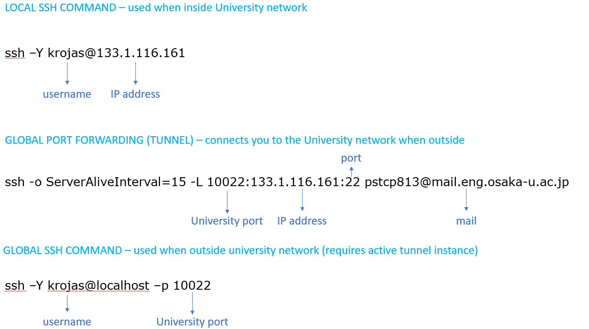

# SMITH UTILITIES
SMITH utilities for local-server interaction

This set of commands are made to make SMITH access easier. All of these are coded in python so it is compatible with both linux, macos, and windows (via wsl).

## Requirements
1. SSHFS
2. FUSERMOUNT
3. PYTHON
4. SSH
5. Registered sshid 

For macos' SSHFS and FUSERMOUNT go to https://sbgrid.org/corewiki/faq-sshfs.md and https://osxfuse.github.io/

For Linux and WSL, use package manager to install these (i.e. `apt install`)

Miniconda is a good python installer.  

## Installation
```
$ git clone https://github.com/kimrojas/smith_utils
$ echo 'export PATH=/home/user/smith_utils:$PATH' >> ~/.bashrc
```

## Initialization
The utility software will ask you for details. Simply use the command to initialize your login details:
```
$ smith_user_setup
```

The rough diagram of the ssh connection based on user input is:  

<!--  -->

## List of Utility Commands
1. smith_help
2. smith_user_setup
3. smith_connect
4. smith_share
5. smith_kstat
6. smith_avail

## Utility Commands Descriptions
### `smith_help`
    Description:
        Shows Basic Utility descriptions

    Usage:
        smith_help

### `smith_user_setup`
    Description:
        Creates a configuration file about ssh login details to smith

    Usage:
        smith_user_setup
            
### `smith_connect`
    Description:
        Initiates an ssh login to smith with smart switch between using a local vs global ssh command, prioritizing local if both are avaialale.
        
        Note: Global ssh command requires a running `smith_tunnel` instance in another window.

    Usage:
        smith_connect
            
### `smith_tunnel`
    Description:
        Creates a connection instance to Osaka University network thus creating a tunnel that allows connection to smith. A running instance of `smith_tunnel` is required for out-of-university logins.

    Usasge:
        smith_tunnel
            
### `smith_share`
    Description:
        Mounts the user's HOME DIRECTORY in smith to the local machine ($HOME/smith_server). This reduces the amount of lag experienced when using X11 forwarding from smith  
        (i.e. xcrysden from smith forwards image, with smith_share smith only forwards the file
        but uses local machine's xcryden).
        
        The user also has the advantage of using personal environment   
        (i.e. local python environment or text editor usage for data processing)

    Usage: 
        smith_share [ mount | unmount ]
            
            
### `smith_kstat`
    Description:
        Sends a query command to smith about the status of the user's jobs. 
        COMMAND = 'qstat -u <username>'

    Usage:
        smith_kstat
    
### `smith_avail`
    Description:
        Sends a query command to smith check on available nodes.
        
    Usage:
        smith_avail
